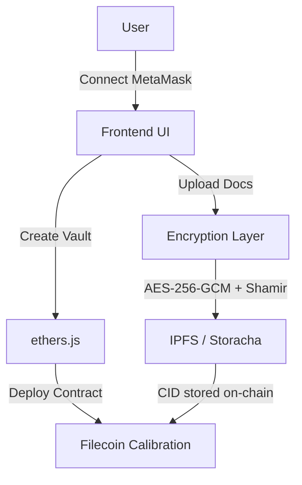
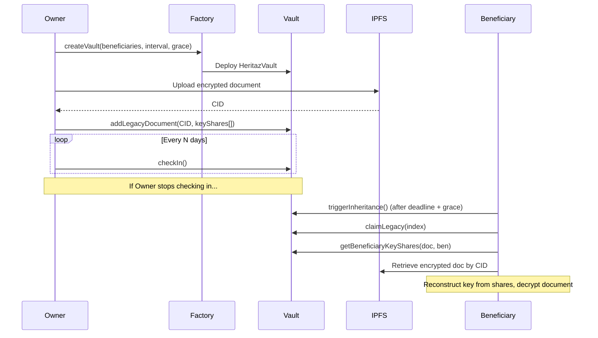

# Heritaz

A complete digital legacy platform built on Filecoin. Dead-man's switch inheritance vaults with encrypted document storage powered by FVM smart contracts and IPFS.

## The Story

Picture this: Someone passes away with millions in crypto. Their family knows they had it, but can't access it. The private keys? Gone forever.

There's no customer service line. No estate lawyer can call the bank and sort it out. If you die without passing on your keys, that wealth just... disappears.

This happens all the time. Not just to legendary crypto creators, but to regular people.

Heritaz fixes this.

## What It Does

Think of it like a dead man's switch for your digital assets and documents.

You set up a vault on Filecoin. Add your family members or whoever you want to inherit. Set a check-in interval and grace period.

Then you just check in regularly. Click a button that says "hey, I'm still here."

If you stop checking in? The vault opens automatically. Your encrypted documents become decryptable by your beneficiaries through Shamir's Secret Sharing.

No lawyers. No passwords to remember. No secret notes hidden in safe deposit boxes.

Just code running on Filecoin.

## How It Actually Works

**Create a vault.** Pick your beneficiaries and what percentage each person gets. Deploy an FVM smart contract on Filecoin Calibration.

**Upload legacy documents.** Files are encrypted client-side with AES-256-GCM. The encryption key is split via Shamir's Secret Sharing and distributed to beneficiaries on-chain. Encrypted files are stored on IPFS with Filecoin persistence.

**Check in periodically.** This resets the timer. As long as you're checking in, nothing happens.

**Automatic transfer.** If the timeout + grace period expires, anyone can trigger inheritance. Beneficiaries claim their share and decrypt the legacy documents.

## Deployments

### Filecoin Calibration Testnet

| Contract | Address | Explorer |
|----------|---------|----------|
| HeritazFactory | `0xAAAa62eA507115287feBf936Bd657a7c899A64b2` | [Blockscout](https://filecoin-testnet.blockscout.com/address/0xAAAa62eA507115287feBf936Bd657a7c899A64b2) |
| Deployer | `0xDe5df44009FD2E13bBAcfED2b8e3833B5Dc4Bf21` | [Blockscout](https://filecoin-testnet.blockscout.com/address/0xDe5df44009FD2E13bBAcfED2b8e3833B5Dc4Bf21) |

**Network Details:**
- Chain ID: `314159`
- RPC: `https://api.calibration.node.glif.io/rpc/v1`
- Currency: tFIL
- Faucet: [faucet.calibnet.chainsafe-fil.io](https://faucet.calibnet.chainsafe-fil.io)
- Explorer: [filecoin-testnet.blockscout.com](https://filecoin-testnet.blockscout.com/)

## Getting Started

```bash
bun install
bun run dev
```

Open http://localhost:3000

You'll need **MetaMask** connected to Filecoin Calibration testnet.

### Add Calibration to MetaMask

| Field | Value |
|-------|-------|
| Network Name | Filecoin Calibration |
| Chain ID | 314159 |
| RPC URL | https://api.calibration.node.glif.io/rpc/v1 |
| Currency | tFIL |
| Explorer | https://filecoin-testnet.blockscout.com/ |

### Get Test tFIL

- [ChainSafe Faucet](https://faucet.calibnet.chainsafe-fil.io)

### FVM Contract Development

```bash
cd contracts/fvm
bun install
npx hardhat compile
npx hardhat test              # 16 tests
npx hardhat run scripts/deploy.ts --network calibration
```

## Architecture

### System Flow


### Vault Lifecycle


### Tech Stack
```
Frontend:     React 18 + Next.js 16.2 + Tailwind + Radix UI
Wallet:       MetaMask (Filecoin Calibration)
   ↓
API:          Next.js API Routes
   ↓
Contracts:    Solidity / Hardhat (FVM on Filecoin Calibration)
   ↓
Storage:      IPFS + Filecoin (via Storacha/w3up)
   ↓
Encryption:   AES-256-GCM (@noble/ciphers) + Shamir SSS (secrets.js-34r7h)
```

### FVM Vault Structure
```solidity
HeritazVault {
  owner: address
  status: Active | GracePeriod | Triggered | Claimed
  checkInInterval: uint256     // seconds
  gracePeriod: uint256         // seconds
  lastCheckIn: uint256         // timestamp

  beneficiaries: [
    { wallet, btcAddress, percentage, publicKeyHash }
  ]

  legacyDocuments: [
    { cid, encryptedKeyShares[], timestamp }
  ]
}
```

### Project Structure
```
/
├── app/                          Next.js app router
│   ├── dashboard/                Vault dashboard
│   ├── vault/create/             Multi-step vault wizard
│   ├── vault/[id]/               Vault detail + check-in
│   ├── vault/[id]/legacy/        Document upload/manage
│   ├── beneficiary/              Beneficiary claims view
│   ├── claim/[vaultId]/          Claim + decrypt flow
│   ├── settings/                 Wallet + network settings
│   └── api/
│       ├── fvm/                  FVM vault state reader
│       └── ipfs/                 IPFS upload/retrieve proxy
├── contracts/
│   └── fvm/                      Solidity smart contracts (Filecoin)
│       ├── contracts/            HeritazVault.sol, HeritazFactory.sol
│       ├── test/                 16 Hardhat tests
│       └── deployments/          Calibration deployment addresses
├── components/
│   ├── providers/                Filecoin wallet provider
│   └── ui/                       Wallet modal, notifications, etc.
├── lib/
│   ├── fvm-vault.ts              FVM contract manager (ethers.js)
│   ├── encryption.ts             AES-256-GCM + Shamir SSS
│   └── ipfs-storage.ts           IPFS upload/retrieve
└── types/
    ├── fvm-vault.ts              FVM type definitions
    └── ipfs.ts                   Encryption/storage types
```

## Testing

```bash
# FVM contract tests (16 tests)
cd contracts/fvm && npx hardhat test

# Frontend build check
bun run build
```

## Important Stuff

This is testnet only. Don't use it with real funds yet.

You need MetaMask browser extension connected to Filecoin Calibration.

## Why This Matters

Billions of dollars in crypto have been lost because someone died without sharing their keys.

Your bank account gets handled by your will. Your house goes through probate. But crypto? It just sits there, locked forever.

This is better. It's automatic. It's trustless. It's just code.

## License

MIT. Use it however you want.

---

Built with Filecoin, FVM, IPFS, and the hope that no one loses their digital legacy because they forgot to plan ahead.
